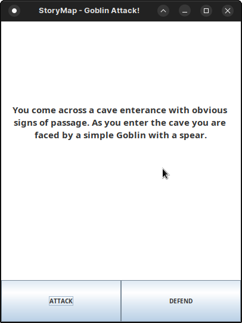

# Interactive StoryMap

Immerse yourself in captivating narratives with the Interactive StoryMap Application. This Java-based app showcases the power of decision trees and dynamic user interactions to create engaging and interactive storytelling experiences.



## Features

- Navigate through stories using a binary decision tree structure
- Intuitive GUI design for seamless user interaction
- Dynamic event handling for immersive storytelling

## Usage

1. Clone the repository
2. Compile and run `Start.java`. Choose between the console and ui versions of the application by commenting out the necessary lines as shown:

```java
public static void main(String[] args) throws FileNotFoundException {
    String pathName = System.getProperty("user.dir") + File.separator + "game-story-map.csv";
    File csvFile = Paths.get(pathName).toFile();
    List<Node> nodes = new CsvToNodes().apply(csvFile);

     // StoryMap storyMap = new StoryMapConsole(nodes);
    StoryMap storyMap = new StoryMapSwing(nodes);

    storyMap.show();
}
```

